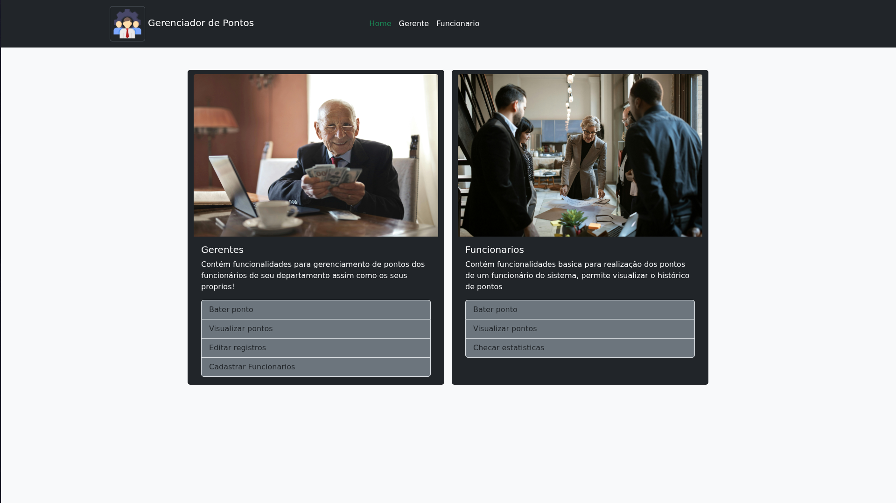
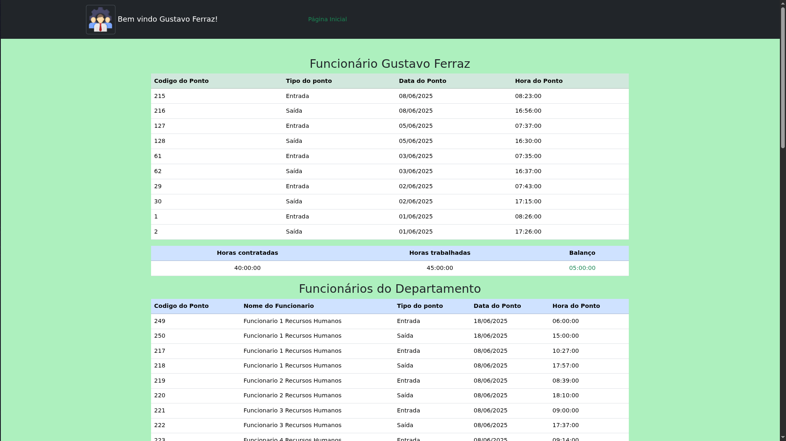

# 🕒 Sistema de Controle de Ponto de Funcionários

> Projeto acadêmico desenvolvido como parte do curso técnico em Desenvolvimento de Sistemas na ETEC de São Paulo.  
> O objetivo é aplicar conceitos de programação web, banco de dados e lógica de negócios em PHP.

---

## 📚 Sobre o Projeto

Este sistema permite o registro de **entrada e saída de funcionários**, possibilitando a consulta posterior por parte de administradores. Foi construído sem frameworks, utilizando apenas tecnologias nativas da web, como HTML, CSS, JavaScript, PHP e MySQL.

---

## 🎯 Objetivos de Aprendizado

- Praticar HTML, CSS e JavaScript puro;
- Desenvolver páginas dinâmicas com PHP;
- Utilizar banco de dados MySQL;
- Criar um CRUD básico;
- Compreender o fluxo de autenticação com sessões em PHP;
- Organizar um projeto seguindo uma estrutura de pastas.

---

## 🛠️ Tecnologias Utilizadas

- HTML5
- CSS3
- JavaScript
- PHP (sem frameworks)
- MySQL
- XAMPP (para ambiente local)

---

## ✅ Funcionalidades

- Registro de ponto (entrada/saída)
- Cadastro e login de usuários
- Consulta de registros por data
- Área de administração (restrita)
- Interface básica e responsiva

---

## 📸 Capturas de Tela

> As imagens abaixo estão na pasta `screenshots/`.

### Tela de Boas Vindas

### Visualização de Pontos

### Painel do Administrador

---

## ⚙️ Como Executar Localmente

1. Clone o repositório no seu ambiente de desenvolvimento Web(Xampp,ou outro qualquer)
2. Utilize o script sql para criação da base de dados(Utilize MySQL ou MariaDB)
